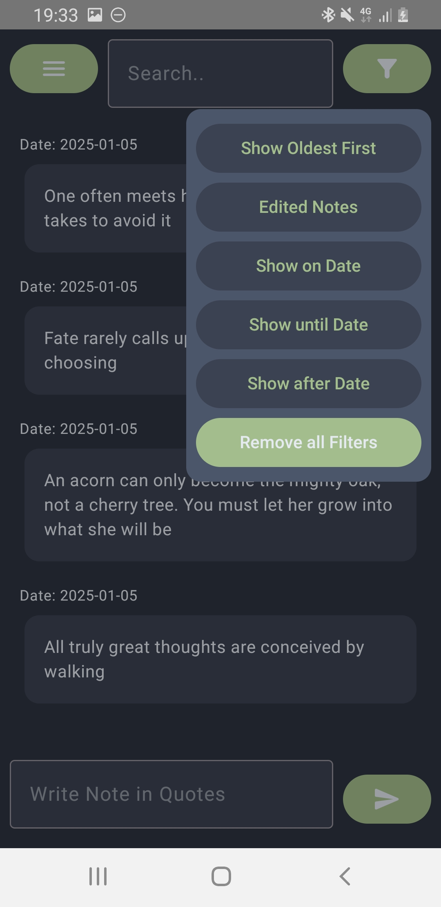

# YouNote!
Your streamlined companion for personal note-taking

## Why Another Note-Taking App?
After an extensive search for the perfect note-taking app that strikes the right balance between functionality and simplicity, I decided to create my own solution.
YouNote draws inspiration from Discord's intuitive approach to messaging, while addressing privacy concerns by keeping all your notes securely stored on your local device. No servers, no sync – just your thoughts, organized your way.

## Features
- Organize notes effortlessly with custom categories
- Create, edit, and manage notes with simple, intuitive controls
- Find any note quickly with powerful search and sorting options
- Keep sensitive information secure with password-protected categories

## Screenshots

| Screenshot 1          | Screenshot 2          | Screenshot 3          |
|------------------------|------------------------|------------------------|
|  |  |  |
